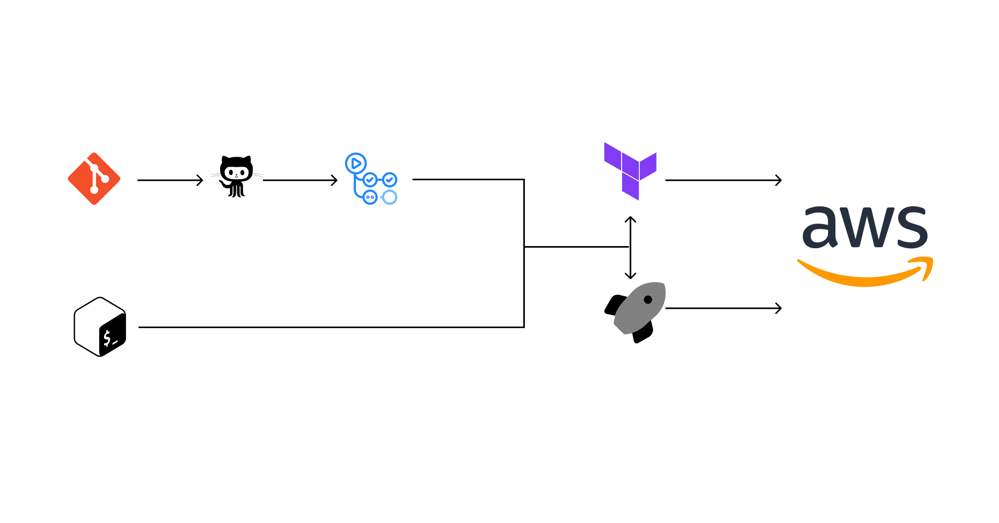

## Active Test

<details  open="open">

:scroll: **Table of Contents**</summary>


<ul>

<li><a  href="#about">About</a></li>

<li>
<a  href="#installation">Installation</a>
</li>

<li>
<a  href="#run-on-github-actions">CI/CD</a>
</li>

<li><a  href="#architecture">Architecture</a></li>
<li><a  href="#next-steps">Next Steps</a></li>
<li><a  href="#contact">Contact</a></li>


</ul>

</li>


</ol>

</details>


---


### ABOUT

A pipeline to provision a kubernetes cluster on aws with terraform, build the services with docker, ensure code quality with eslint and jest and enforces the quality standard with pre-commit hooks using husky.


---
### INSTALLATION

#### PERQUISITES

You need to have the following installed:

1. Docker
3. AWS CLI
3. Terraform CLI
4. Kubectl

---

#### STEPS
  

1. Clone this repository and open your terminal/command line app in the root folder

2. Modify the permission of the run.sh script

``` chmod u+x run.sh ```

3. Run the script with the your aws credentials

``` ./run.sh deploy --aws_access_key=<value> --aws_secret_key=<value> ```


4. To validate the provisioned environment:

``` ./run.sh test env```

5. To validate the service endpoint run:

``` ./run.sh test app```

6. To clean up the pipeline run:

``` ./run.sh clean  --aws_access_key=<value> --aws_secret_key=<value> ```

---

### RUN ON GITHUB ACTIONS

#### PERQUISITES

You need add the following secrets and variable:

1. AWS_ACCESS_KEY_ID: Alongside, AWS_SECRET_ACCESS_KEY, they will be used to authorize the infrastructure provisioning, as well as authorizing ECR container push and getting the EKS kube_config file.

2. AWS_SECRET_ACCESS_KEY
3. EKS_ARN: the arn of the kubernetes cluster, will be used as the key to setting the kube_config as 
4. ENCRYPTION_KEY: the purpose of an encryption key is so encrypt the state file and store it as a Github Action artifact.
5. PUBLIC_ECR_REGISTRY_URI: the uri the containerized server will be pushed to.

#### STEPS

1. Fork this repository or Clone the repository.

2. Add the secrets and variable mentioned above

3. Change the CI/CD branch trigger to match the branch you want it to operate on.

4. Push to the infra directory to provision the infrastructure.

4. Push to the server directory to deploy the server

---

## ARCHITECTURE  




Provisioning and deployment can be done using a bash script or from CI/CD pipeline, overview of the workflow

1. **Provisioning a Kubernetes Cluster with Terraform:**

   - **Terraform**: Terraform is an Infrastructure as Code (IaC) tool that allows to definition and provisioning infrastructure resources. Terraform scripts were used to define AWS infrastructure, including the Kubernetes cluster, VPC, subnets, security groups, and any other necessary resources.

   - **AWS**: Amazon Web Services (AWS) is the cloud provider used to create the Kubernetes cluster. AWS services like EC2, EKS, and others for infrastructure were provisioned.

2. **Deployment:**

   - **Building Services with Docker**: Docker is a containerization platform that was used to package the application and its dependencies into containers. 

   - **Ensuring Code Quality with ESLint and Jest:**

   - **ESLint**: ESLint is a popular JavaScript linter that helps enforce coding style and identify potential issues in the code. ESLint is defined to define  coding standards and run it as part of the CI/CD pipeline.

   - **Jest**: Jest is a JavaScript testing framework that can be used for unit and integration testing. Jest runs written test cases as part of the CI/CD pipeline.

   - **Enforcing Quality Standards with Pre-commit Hooks using Husky:**

   - **Husky**: Husky is a tool that helps enforce quality standards and best practices by running scripts or commands before commits are made. Husky can trigger ESLint, Jest, or other checks before code is committed to version control (e.g., Git).

3. **CI/CD Pipeline Integration:**

   - **Continuous Integration (CI):** Using a CI service like Jenkins, Travis CI, CircleCI, or GitLab CI/CD to set up a pipeline that automates the entire process. the CI/CD pipeline would include stages for provisioning infrastructure, building Docker images, running ESLint and Jest tests, enforcing pre-commit hooks and deploying the code.

  - **Deployment:** Deploy Dockerized services to the Kubernetes cluster using tools like kubectl or Helm charts. CI/CD pipeline can automate this deployment process.
---
## NEXT STEPS


1. **Monitoring and Logging:**

   - Consider integrating monitoring and logging solutions like Prometheus, Grafana, ELK (Elasticsearch, Logstash, Kibana), or cloud-native services to monitor the Kubernetes cluster and application services.


2. **Continuous Deployment Strategies:**

   - Depending on the requirements, strategies like blue green can be implemented to achieve zero downtime in production.

3. **Security and Access Control:**

    - Ensure that security best practices are implemented, including access control, image scanning, and secrets management, to protect your Kubernetes cluster and application.

4. **Scaling and High Availability:**

    - Implement scaling and high availability strategies within the Kubernetes cluster to ensure the application can handle increased load and maintain uptime.


---

  <!-- CONTACT -->

## Contact

  

*   Shehu-Fatiudeen Oluwaseun Lawal 
*   [Mail](mailto:shehufatiudeen@gmail.com)
*   [LinkedIn](https://linkedin.com/in/fatiudeen/)
*   [Twitter](https://twitter.com/fatiudeen_)
*   [Whatsapp](https://wa.me/2348061316131)

:scroll: **END**